# Board Mount Designer UI Mockups

## Status

These mockups are the **owner-approved guiding UI direction** for Board Mount Designer implementation, ratified by [ADR 0011](../decisions/0011-board-mount-designer-ui-direction.md) (2026-08-16). They are hand-authored static HTML pages rendered to PNG — not screenshots of a running product, and not evidence that any feature is Built or Verified. They give implementation its shared visual target for layout, workflow order, state vocabulary, and honesty rules from [UX Vision](../UX_VISION.md); material departures during implementation should be deliberate and recorded per ADR 0011.

The board in the images, **MG-DEV-01**, is a fictional sample board drawn for these mockups. All dimensions, timestamps, and file names shown are illustrative.

## What The Set Covers

The nine screens walk the [minimum user journey](../workflows/BOARD_MOUNT_DESIGNER.md) and cover every required early state named in UX Vision: empty project, missing image, uncalibrated image, invalid calibration, missing required dimensions, keep-out conflict, export not ready, export in progress, export failure, and export complete.

| Mockup | Journey steps | States shown |
|---|---|---|
| 01 Library | Start a local project | Local-first shell, tool library, Board Mount Assembly parked as future scope |
| 02 Empty designer | Choose tool, add reference | Empty project / missing image, unknown-is-not-zero fields |
| 03 Calibration | Calibrate reference plane | Uncalibrated banner, px-only readouts, provenance capture |
| 04 Invalid calibration | Calibrate (error path) | Rejected implausible scale, explain-why-and-which-input-fixes-it |
| 05 Outline + holes | Outline, holes, exact editing | Confirmed / Measured / Inferred / missing-diameter error |
| 06 Keep-outs | Keep-outs and clearances | Keep-out conflict warning with fix options |
| 07 Mount + preview | Strategy, synchronized 2D/3D | Generated state, deterministic regenerate, derived-preview warning |
| 08 Export ready | Export | Readiness checklist, STEP target + STL secondary, recorded metadata |
| 09 State sheet | Cross-cutting | Missing image, export blocked / in progress / failed / complete, confirming an inferred value |

## The Mockups

### 01 — Project and tool library

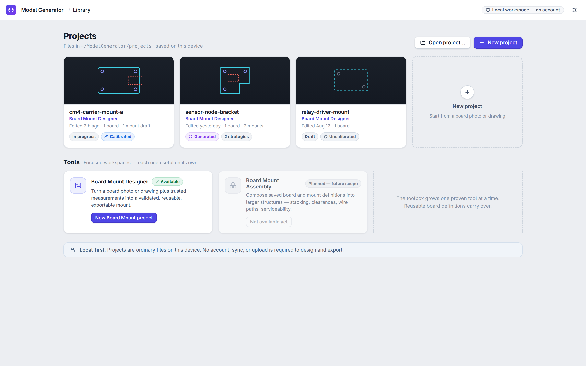

### 02 — Empty project: add a board reference

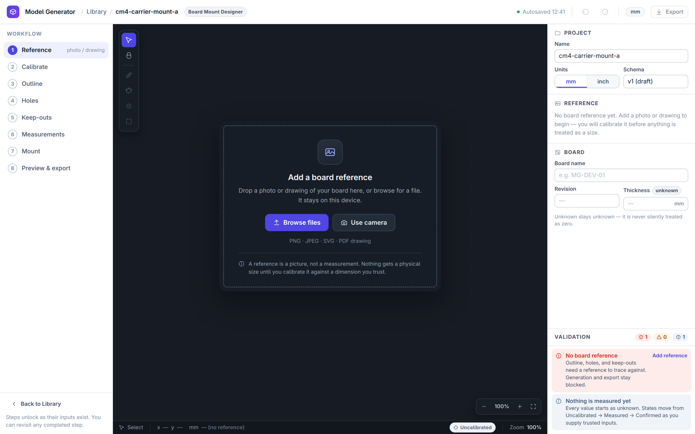

### 03 — Calibrating the reference

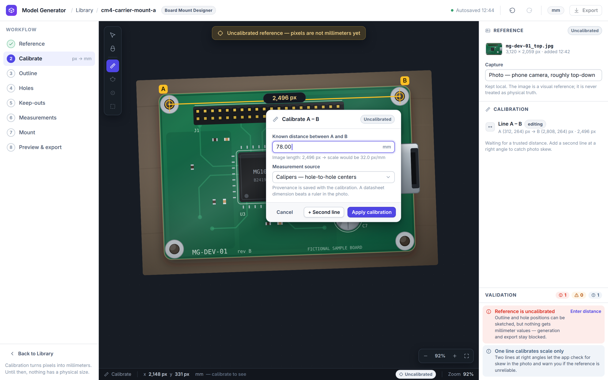

### 04 — Invalid calibration

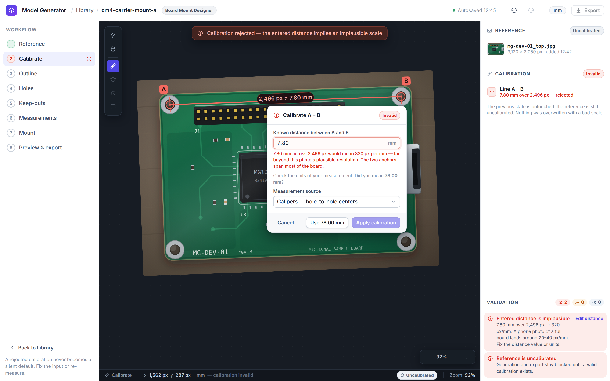

### 05 — Outline and mounting holes

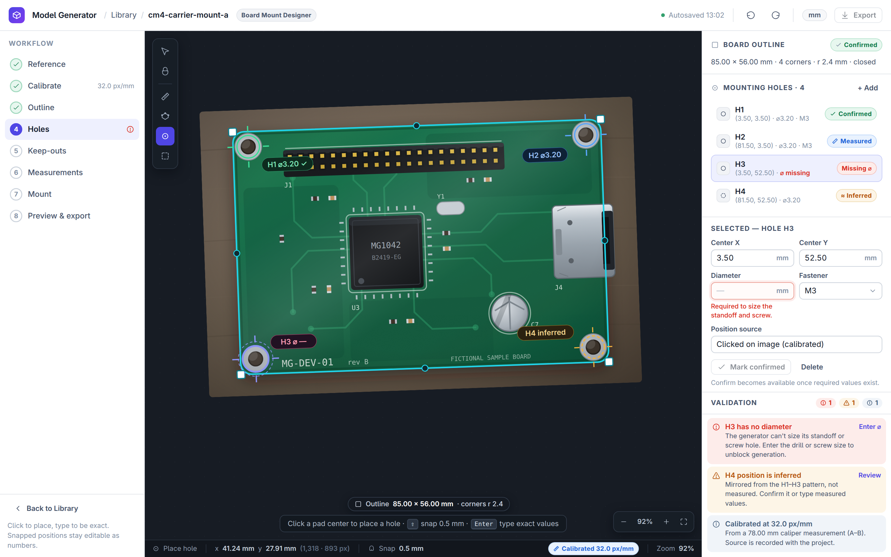

### 06 — Keep-outs and a conflict

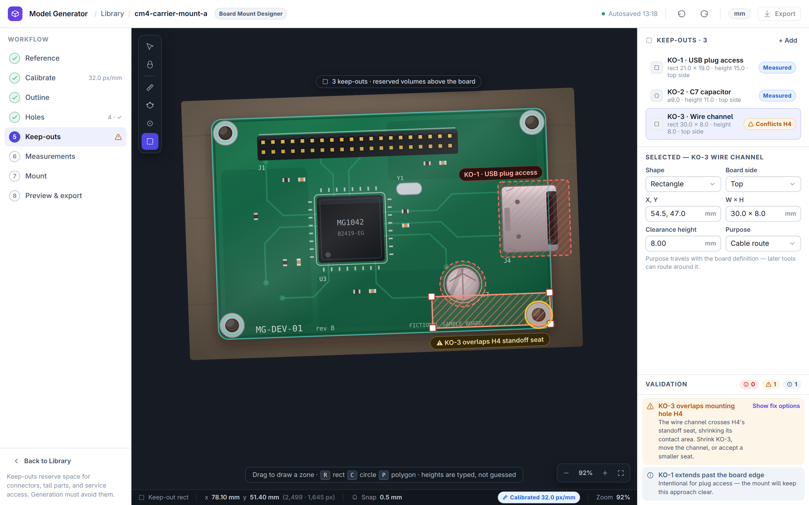

### 07 — Mount strategy with synchronized 2D/3D

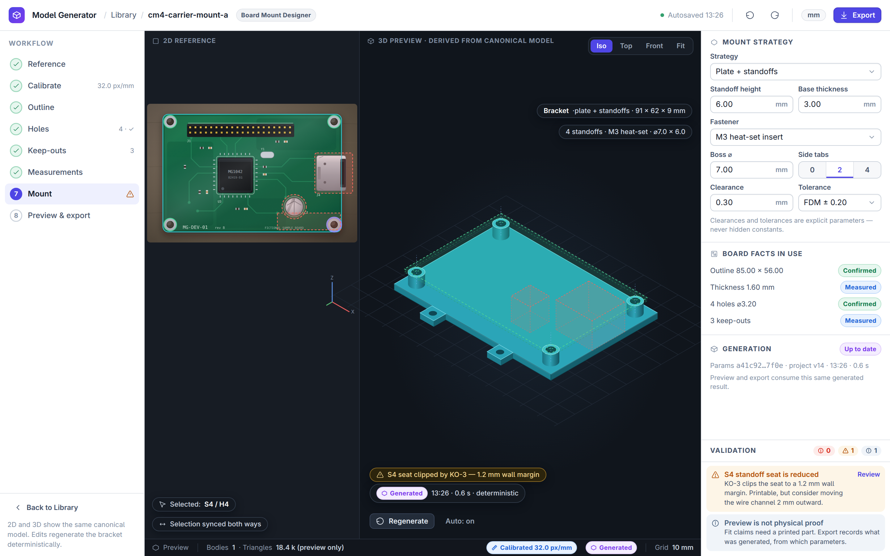

### 08 — Export

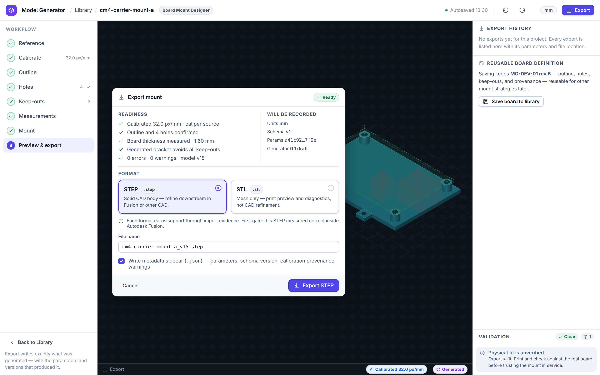

### 09 — Required early states

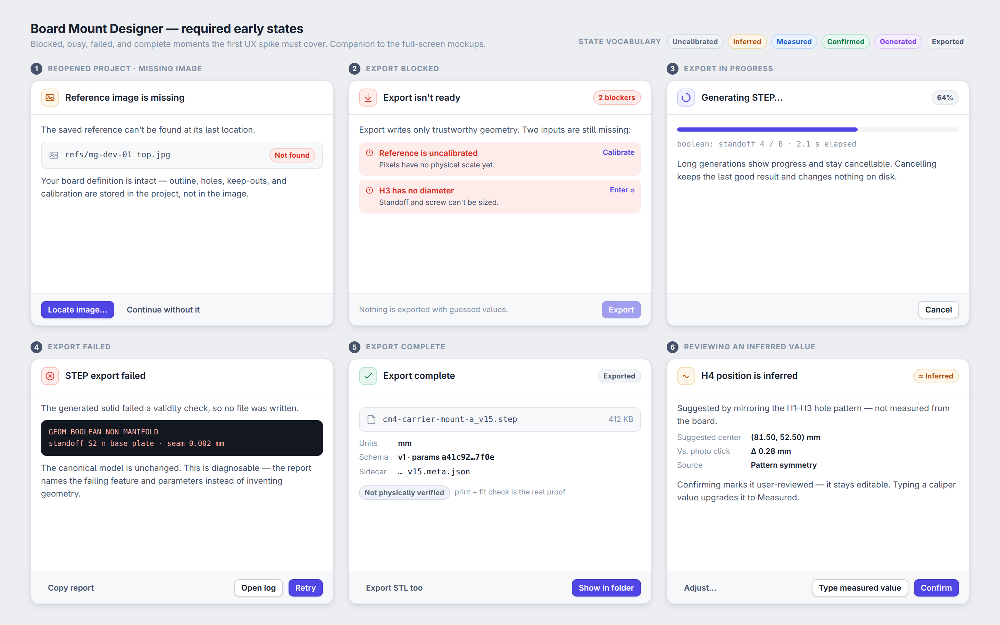

## Dark Mode

The design system is fully token-themed: dark mode restyles the application chrome (panels, rails, inspectors, dialogs, library) while the editing canvas stays a dark instrument surface in both themes. Three representative dark renders are committed as references — the full token tables live in the [component spec](COMPONENT_SPEC.md), and any mockup page can be viewed dark by appending `?theme=dark`.

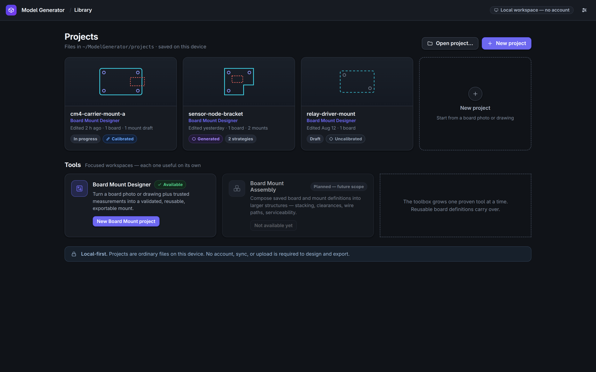

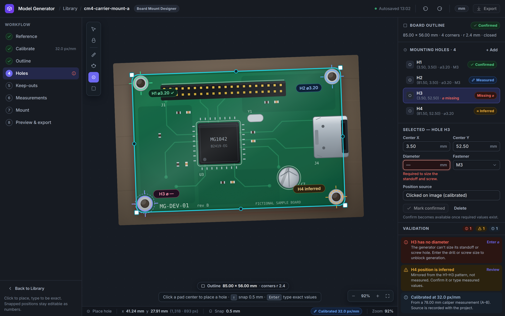

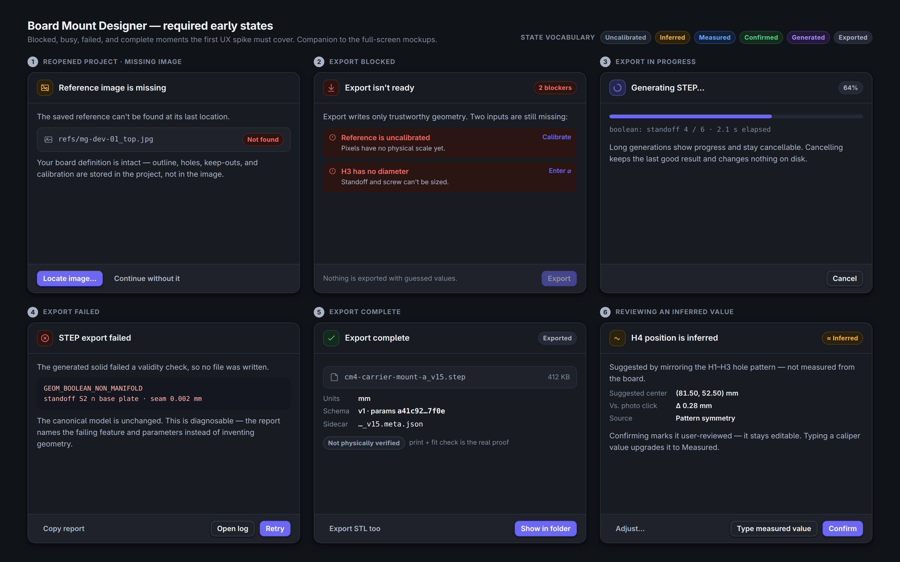

## Design Language Notes

The implementable version of these notes — complete component inventory, design tokens for both themes, layout metrics, canvas mark specs, interaction contracts, and accessibility rules — is the [Board Mount Designer Component Spec](COMPONENT_SPEC.md).

- Light application chrome around a dark editing canvas; one indigo accent; amber/red/blue/green reserved for state meaning.
- State chips use the exact [UX Vision state vocabulary](../UX_VISION.md) — Uncalibrated, Inferred, Measured, Confirmed, Generated, Exported — always icon + label, never color alone.
- Layout follows the workspace direction: workflow rail, primary 2D surface, synchronized 3D preview, contextual inspector, persistent validation panel, visible path back to the library.
- Component idiom is Tailwind/shadcn-adjacent with lucide-style stroke icons, per the accepted Cadence-adjacent posture in [ADR 0003](../decisions/0003-local-first-product-posture.md). It is an original composition; nothing is copied from Gridfinity Layout Tool or any other product.
- Typeface: Inter (SIL OFL), loaded from the rendering machine at render time — no font binaries are vendored into this repository.

## What These Mockups Do Not Promise

Per UX Vision, nothing in these images implies that:

- image recognition is automatic or accurate — every trace, hole, and zone shown is manually placed; the only inference shown (H4) is plain geometric mirroring, flagged and requiring review;
- dimensions can be trusted without calibration — uncalibrated screens show pixel-only readouts and blocked generation;
- export formats are finally selected — STEP-into-Fusion is the MVP evidence gate from ADR 0010, and the export contract remains owned by ADR 0006;
- a geometry kernel is selected — the 3D bracket is an illustration, not kernel output;
- cloud sync or AI assistance is required — the shell is explicitly local-first with no account;
- physical fit has been validated — export screens carry a "not physically verified" state;
- the visual style is frozen pixel-for-pixel — it is the owner-approved guiding direction (ADR 0011), refined through normal review, not an immutable identity.

## Regenerating

Sources live in [`mockups/src/`](mockups/src/) — one HTML file per screen, a shared stylesheet, the fictional board photo SVG, and the isometric bracket SVG. Rendering is documentation tooling, not a product command:

```bash
CHROMIUM_BIN=/path/to/chromium docs/design/mockups/src/render.sh
```

The script captures each page at 1440×900 css (2880×1800 px) with headless Chromium and crops with Pillow, then renders the dark-chrome variants of screens 01, 05, and 09 via the `?theme=dark` switch. Edit the HTML, re-run, and commit both source and PNG.

## Relationship To The UX Spike

NEXT names a "first UX/workflow spike" whose exit condition is a low-fidelity interactive flow covering the required states, with usability notes. These static mockups are an input to that spike, not its completion: they contribute the workflow order, state vocabulary, and honesty rules, while interaction, keyboard operation, focus order, and usability evidence remain open.
